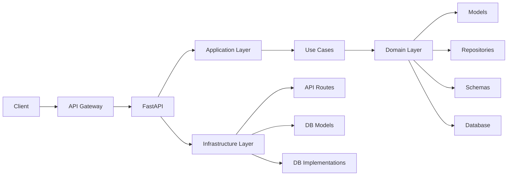

# Inventory service

A FastAPI-based microservice for managing inventory with a clean architecture approach.

## Architecture

This project follows Clean Architecture principles, organizing code into the following layers:

### Domain Layer
- `app/domain/models.py`: Core business entities and value objects
- `app/domain/repositories.py`: Abstract repository interfaces
- `app/domain/schemas.py`: Pydantic models for data validation

### Application Layer
- `app/application/use_cases.py`: Business logic and use case implementations

### Infrastructure Layer
- `app/infrastructure/api/`: FastAPI routes and API configuration
- `app/infrastructure/db/`: Database models and implementations

## Architecture Diagram



## Project Structure
```
inventory/
├── alembic/              # Database migrations
├── app/
│   ├── application/      # Use cases and business logic
│   ├── domain/          # Business entities and interfaces
│   ├── infrastructure/  # External interfaces implementation
│   └── main.py         # Application entry point
├── tests/
│   ├── integration/    # Integration tests
│   └── unit/           # Unit tests
└── requirements.txt    # Project dependencies
```

## Setup

1. Clone the repository
2. Copy `.env.example` to `.env` and configure environment variables
3. Build and run with Docker:
```bash
docker-compose up --build
```

## Database Migrations

This project uses Alembic for database migrations:

```bash
# Create a new migration
docker-compose run --rm inventory alembic revision --autogenerate -m "description"

# Apply migrations
docker-compose run --rm inventory alembic upgrade head
```

# Testing

Run tests using:

```bash
# Run all tests
docker-compose run --rm inventory pytest
# Run with coverage
docker-compose run --rm inventory pytest --cov=app

# Run specific test types
docker-compose run --rm inventory pytest tests/unit/
docker-compose run --rm inventory pytest tests/integration/
```

## API Documentation

Once the service is running, access the API documentation at:
- Swagger UI: http://localhost:8000/docs
- ReDoc: http://localhost:8000/redoc

## Technologies

- FastAPI: Web framework
- SQLAlchemy: ORM
- Pydantic: Data validation
- Alembic: Database migrations
- PostgreSQL: Database
- Docker: Containerization
- Pytest: Testing framework